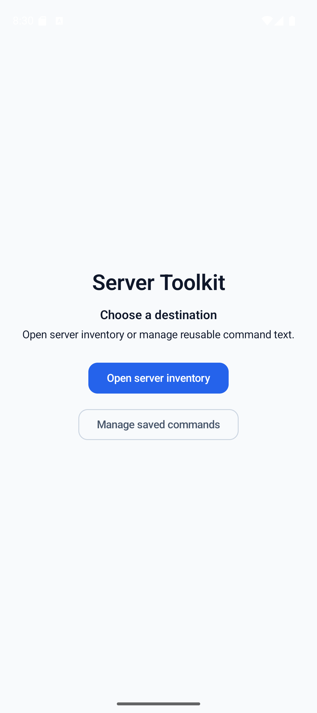
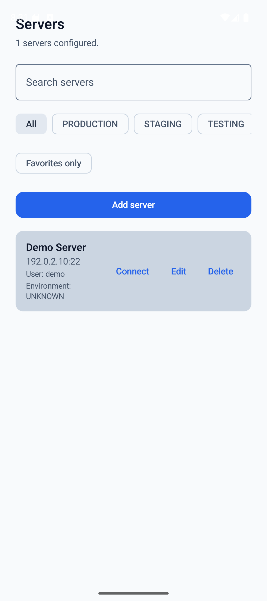
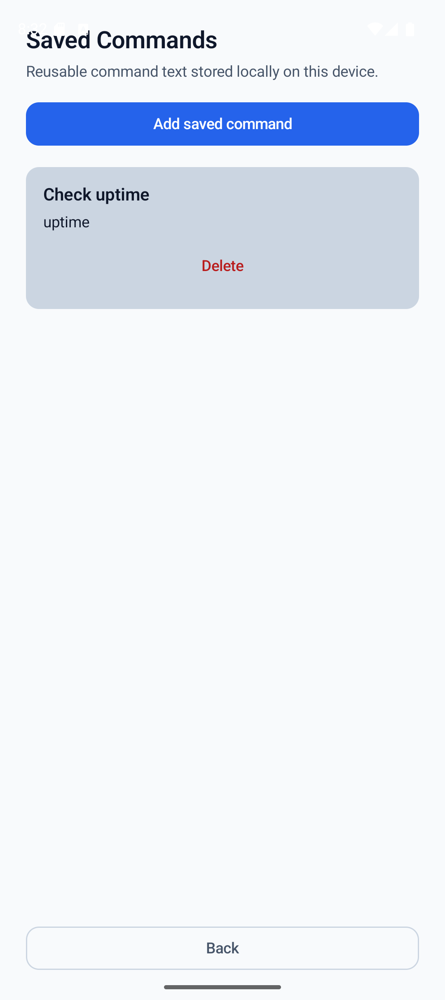

# Server Toolkit

**Structured remote-system operations for Android.**

Server Toolkit is a production-oriented Android application for system administrators, DevOps engineers, infrastructure engineers, network engineers, and homelab operators who need organized mobile access to server inventory and explicit remote-operation workflows.

It is **not a terminal clone**. SSH is currently the first verified remote-access capability, while the product model remains platform-neutral and designed to support additional operational capabilities over time.

**Current release:** `v0.4.0 — SSH` · **Active milestone:** `v0.5.0 — Operations`

---

## Screenshots

<p align="center">
  
  
  
</p>

---

## What Works Today

Server Toolkit currently provides:

- **Server Inventory**
  - local Room-backed persistence;
  - add, edit, delete, and search workflows;
  - environment and favorites-only filtering.

- **Secure SSH Workflows**
  - ephemeral password authentication;
  - ephemeral Android document-picker private-key authentication;
  - verified OpenSSH v1 Ed25519 and RSA private-key support;
  - explicit host-key trust review and trusted-host persistence;
  - project-owned SSH session lifecycle, disconnect, reconnect, and deterministic cleanup.

- **Explicit Command Execution**
  - non-interactive SSH command execution;
  - stdout, stderr, and exit-status presentation;
  - command execution only through an explicit user action.

- **SSH Connection History**
  - automatic Room-backed connection-outcome recording;
  - per-server history presentation.

- **Saved Commands**
  - local persisted reusable command text;
  - validated creation and explicit deletion;
  - inline selection from the SSH workflow;
  - exact command-input replacement without automatic execution;
  - continued manual editing of the SSH command input before the explicit Run action.

The current runtime evidence is centered on SSH workflows against tested OpenSSH-compatible targets. Architectural extensibility is **not** treated as a support claim.

---

## Product Direction

Server Toolkit models remote-system operations independently from one operating system, distribution, shell, service manager, transport, vendor, or infrastructure service.

```text
Server Inventory
      ↓
Connection capabilities
      ↓
Operational actions
      ↓
Status / evidence / history
      ↓
Additional remote capabilities over time
```

Platform- or service-specific behavior is introduced behind explicit project-owned boundaries only when a concrete feature requires it.

Key architectural decisions:

- [ADR-015 — Platform-Neutral Remote Systems Product Direction](docs/adr/ADR-015-platform-neutral-remote-systems-product-direction.md)
- [ADR-016 — Three-Level Remote Capability Architecture](docs/adr/ADR-016-three-level-remote-capability-architecture.md)

---

## Architecture

Server Toolkit uses modern Android application architecture with clear ownership boundaries.

```text
UI
 ↓
Presentation
 ↓
Domain contracts and models
 ↑
Data implementations
```

Remote capabilities may introduce an additional gateway/provider boundary when translation, routing, discovery, normalization, orchestration, or external-system isolation is actually required:

```text
Core capability contract
 ↑
Capability Gateway
 ↑
Provider / Adapter
 ↑
Transport or external system
```

The project deliberately avoids speculative abstractions for features that do not need them.

---

## Security and Execution Safety

The current SSH and command workflows are designed around explicit user intent:

- passwords, private keys, and passphrases are not persisted as reusable credentials;
- host identity changes are not silently accepted;
- Saved Command selection never executes a command automatically;
- command execution requires the explicit `Run command` action;
- SSH session ownership and cleanup remain project-controlled.

See [SSH Status](docs/state/SSH_STATUS.md) for the implemented support boundary.

---

## Technology

- Kotlin
- Jetpack Compose
- Material 3
- MVVM
- Navigation Compose
- Room
- Hilt
- Coroutines and Flow
- SSHJ

Implemented toolchain and dependency versions are maintained in [Build Toolchain Status](docs/state/BUILD_TOOLCHAIN_STATUS.md).

---

## Project Status

| Version | Focus | Status |
|---|---|---|
| `v0.4.0` | SSH | Released |
| `v0.5.0` | Operations | In progress |
| `v0.6.0` | Dashboard Evolution | Planned |

The `v0.5.0 — Operations` milestone currently builds on the Saved Command foundation and explicit SSH input integration. Future work remains incremental and must preserve explicit execution semantics.

See the [Roadmap](docs/ROADMAP.md) for the full planned evolution.

---

## Release

The latest published release is **Server Toolkit v0.4.0 — SSH**.

Release artifacts include the signed APK, SHA-256 checksum, and release-verification evidence.

[View releases](https://github.com/hamedtanha/ServerToolkit/releases)

---

## Documentation

The repository documentation is the project source of truth.

Start here:

- [Product Vision](docs/PRODUCT_VISION.md)
- [Project State](docs/PROJECT_STATE.md)
- [Architecture](docs/ARCHITECTURE.md)
- [Architecture Atlas](docs/ARCHITECTURE_ATLAS.md)
- [Roadmap](docs/ROADMAP.md)
- [Engineering Handbook](docs/engineering/README.md)
- [Architecture Decision Records](docs/adr/README.md)
- [Design System](docs/DESIGN_SYSTEM.md)
- [Changelog](docs/CHANGELOG.md)

GitHub Wiki is intentionally not used; engineering documentation remains versioned with the source repository.

---

## Engineering Approach

Server Toolkit is developed as a production-quality engineering project:

- GitHub Flow;
- Conventional Commits;
- Semantic Versioning;
- automated Android validation;
- explicit architecture decisions;
- synchronized living documentation;
- focused, independently reviewable changes.

---

## License

Server Toolkit is available under the [MIT License](LICENSE).
