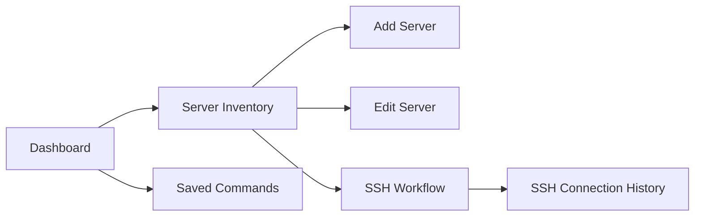
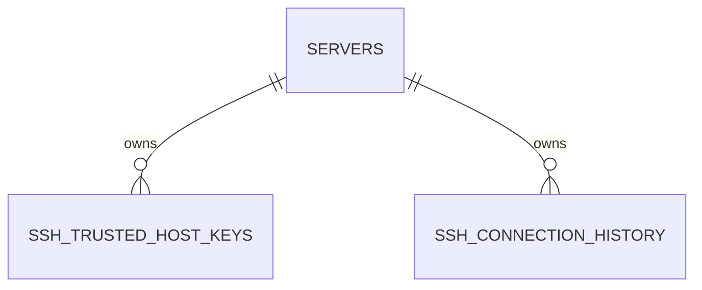
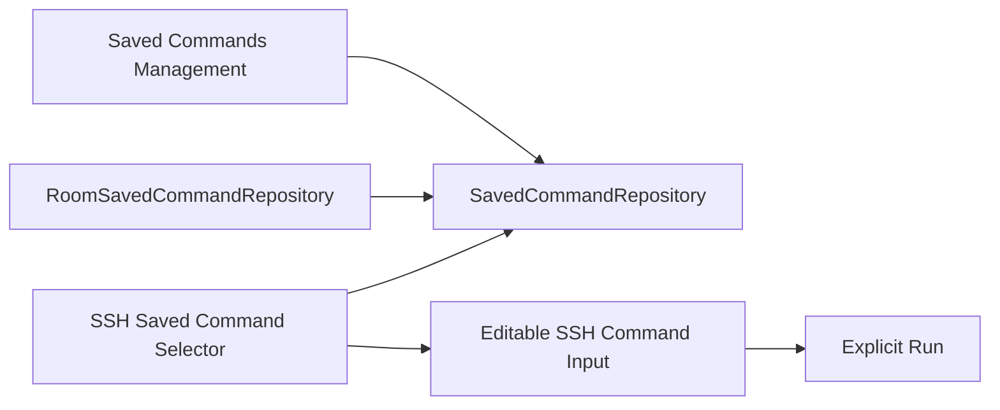

# ServerToolkit Architecture Atlas

> **Atlas version:** `2026.09`  
> **Status:** Living current-state map  
> **Evidence refresh:** Issue `#188` / PR `#189`, based on `main@531f0b0415114cb9372bd7cae0c48c61d345c611` plus the focused F07/F09 remediation  
> **Last Updated:** 2026-09-06  
> **Repository:** `hamedtanha/ServerToolkit`

## 1. Purpose and Authority

This Atlas is the integrated current-state architecture map for Server Toolkit.

It combines repository topology, ownership, dependency direction, persistence, SSH lifecycle, Saved Commands integration, validation, release, ADR, and documentation boundaries.

It does not replace executable source/configuration, accepted ADRs, `docs/PROJECT_STATE.md`, focused `docs/state/` documents, `docs/ARCHITECTURE.md`, or `PACKAGE_STRUCTURE.md`.

When the Atlas conflicts with executable repository evidence, executable evidence governs and the Atlas must be corrected.

Published reviews remain immutable historical evidence. The living Atlas may change as the repository changes.

## 2. Evidence Model

| Evidence class | Role | Authority |
|---|---|---|
| Source/configuration and executable validation | Behavior, dependencies, schema, workflow, lifecycle | Primary |
| Project State and focused state docs | Accepted current implementation summary | Current-state authority |
| Accepted ADRs | Durable decisions and rationale | Governing intent |
| Architecture/engineering docs | Implementation and delivery policy | Policy authority |
| Roadmap/changelog | Planned direction and notable history | Supporting authority |
| Published reviews | Time-bound findings and recommendations | Historical evidence |

Support claims distinguish architecturally permitted, implemented, and verified behavior.

## 3. Product and Architecture Posture

Server Toolkit is a platform-neutral remote systems operations application.

SSH is the current verified remote-access capability. It is one product capability, not the complete product identity.

### Android application view

```text
UI
 ↓
Presentation
 ↓
Domain contracts and models
 ↑
Data implementations
```

### Remote capability view

```text
Presentation / Use Case
        ↓
Core capability contract
        ↓
Capability Gateway
        ↓
Provider / Adapter
        ↓
Transport or external system
```

The Gateway/Provider view is introduced only for concrete routing, translation, discovery, normalization, orchestration, policy, or integration needs.

## 4. Repository Topology

```text
.
├── .github/workflows/android-validation.yml
├── app/
│   ├── build.gradle.kts
│   ├── schemas/
│   └── src/
├── config/release/
├── docs/
│   ├── adr/
│   ├── ai/
│   ├── engineering/
│   ├── state/
│   ├── ARCHITECTURE.md
│   ├── ARCHITECTURE_ATLAS.md
│   ├── DOCUMENTATION.md
│   ├── ENGINEERING_STRATEGY.md
│   ├── PRODUCT_VISION.md
│   ├── PROJECT_STATE.md
│   └── ROADMAP.md
├── review/architecture/
├── scripts/
│   ├── architecture/check-dependencies.sh
│   └── release/
├── PACKAGE_STRUCTURE.md
└── README.md
```

### Android source topology

```text
de.hamedtanha.servertoolkit
├── core
│   ├── connection/domain
│   ├── database
│   └── di
├── feature
│   ├── dashboard
│   ├── savedcommands
│   ├── serverinventory
│   └── ssh
├── navigation
└── ui/designsystem/theme
```

Empty root `data`, root `domain`, and `core/common` scaffolding are not part of the canonical topology. Packages exist for implemented responsibilities only.

## 5. Ownership Matrix

| Boundary | Owns | Must not own |
|---|---|---|
| Application shell | Android entry points and app composition | Feature business behavior, Room/SSHJ internals |
| `core/connection` | Non-sensitive shared connection-target meaning/resolution contracts | Credentials, trust, sessions, transport implementation |
| `core/database` | Application Room schema aggregation and migrations | Feature business policy |
| `core/di` | Application-wide dependency construction | Feature behavior |
| Dashboard | Operational overview and entry actions | Feature persistence |
| Server Inventory | Server records, inventory workflows/persistence, connection-target resolver implementation | SSH session lifecycle |
| SSH | Trust, ephemeral auth, SSHJ adapters, session lifecycle, command input/execution/output/history | Saved Commands data/presentation implementations |
| Saved Commands | Global command definitions, persistence, management UI, navigation | SSH transport/session/execution ownership |
| App navigation | Cross-feature destination composition | Feature data ownership |
| `ui/designsystem/theme` | Application-wide visual theme/profile tokens | Feature behavior |
| `docs/` | Living current state and policy | Immutable review snapshots |
| `review/` | Evidence-bound reviews/findings | Mutable current-state authority |

## 6. Executable Dependency Contract

The repository enforces production Kotlin dependency rules with:

```text
scripts/architecture/check-dependencies.sh
```

The checker runs in the normal Android Validation build job before Gradle build/unit tasks.

Core invariants:

```text
Domain !-> Android / AndroidX / Room / SSHJ
Domain !-> Data / Presentation
Data !-> Presentation
Feature A data !-> Feature B data
Feature A presentation !-> Feature B presentation/data/DI
Presentation !-> Room / concrete repositories
```

Accepted stable cross-feature contract:

```text
SSH presentation -> Saved Commands domain
```

### Named narrow exceptions

1. `SshScreen.kt -> AndroidSshPrivateKeySourceFactory` at the Android document-picker composition boundary.
2. `SshTrustedHostKeyEntity.kt -> ServerEntity` for Room foreign-key metadata.
3. `SshConnectionHistoryEntity.kt -> ServerEntity` for Room foreign-key metadata.

Central Room aggregation remains separately accepted:

```text
core/database -> feature-owned Room entities and DAOs
```

Exceptions are source/import-specific, not broad allowlists. New exceptions require focused review and synchronized executable/documentation changes.

Architecture review `RA-2026.09-v1` finding F07 originally identified the lack of executable enforcement. Issue `#188` / PR `#189` implements the focused check and red/green gate evidence without a module split or external architecture-testing framework.

## 7. Navigation Topology



Permanent exit from an active SSH workflow waits for required session cleanup.

## 8. Persistence Topology

Current Room database version:

```text
5
```

Registered areas:

```text
servers
ssh_trusted_host_keys
ssh_connection_history
saved_commands
```

Migration sequence:

```text
1 -> 2
2 -> 3
3 -> 4
4 -> 5
```

Relationship summary:



Persistence invariants:

- feature-owned entities/DAOs remain in their features;
- repositories expose project-owned domain models;
- Room entities do not leak to presentation;
- Server updates use non-destructive upsert behavior;
- explicit Server deletion retains child cascades;
- Saved Commands are global and have no Server foreign key;
- ordinary Room tables do not store credential secrets.

## 9. SSH Runtime Architecture

### Target resolution

SSH receives a Server identifier and resolves non-sensitive host/port/username metadata through the project-owned `core/connection` contract implemented by Server Inventory.

### Trust

- Unknown host keys require explicit user confirmation.
- Changed keys are blocked.
- New observations/trust use canonical OpenSSH SHA-256 fingerprints.
- Historical SSHJ MD5 and Java-encoded SHA-256 trust rows remain explicitly verifiable without silent rewrite.
- Unknown persisted fingerprint schemes fail closed.

### Authentication

- Passwords are transient.
- Private-key documents are one-attempt, bounded, and non-persistent.
- Passphrases remain outside observable state.
- Persistent credential storage is not implemented.

### Session lifecycle

- Authenticated sessions are represented upward by project-owned handles.
- Cancellation/timeout during connection handoff cannot leave an unreachable registered owner.
- Normal workflow exit/disconnect uses awaited cleanup with retry semantics while the workflow lives.
- Permanent workflow-owner destruction transfers abandoned ownership to data-layer cleanup outside `viewModelScope`.
- Background session continuity is not implemented.

### Command execution

- Execution is explicit and non-interactive.
- stdout/stderr are drained concurrently.
- Retained output is bounded to `256 KiB` per stream with explicit truncation.
- One operation deadline covers command completion and output draining.
- Output is ephemeral and not persisted.

## 10. Saved Commands Integration



- Commands are global.
- Command text is preserved exactly.
- Persistence never executes command text.
- SSH presentation consumes Saved Commands domain contracts only.
- Selection replaces editable input; Run remains the only execution trigger.

## 11. Collection UX Contract

ADR-017 defines scalable collection invariants:

- lazy rendering for growing collections;
- stable item identity;
- primary content must not be destructively compressed by action regions;
- long content/font scaling/constrained width are first-class validation cases;
- pagination remains evidence-driven.

The remaining constrained Server Inventory layout implementation is tracked separately by Issue `#161` / review finding F10. It is not part of the F07/F09 architecture-enforcement slice.

## 12. Build, CI, and Release Topology

### Android Validation

Pull requests targeting `main`, pushes to `main`, and manual dispatch use `Android Validation`.

Build/unit job:

```text
architecture dependency check
:app:compileDebugKotlin
:app:compileDebugAndroidTestKotlin
:app:testDebugUnitTest
:app:lintDebug
:app:assembleDebug
:app:assembleDebugAndroidTest
```

Managed-device job:

```text
ciApi36
Pixel 2
Android API 36
AOSP ATD x86_64
:app:ciApi36DebugAndroidTest
```

Required status context:

```text
Validate Android project
```

The required gate fails unless both build/unit and instrumentation layers succeed. Architecture failure occurs before Gradle validation and prevents the instrumentation dependency from running, so a layer violation cannot yield a green aggregate gate.

### Current build cluster

```text
Gradle 9.6.1
Android Gradle Plugin 9.4.0
Kotlin 2.4.10
KSP 2.3.10
Java source/target + Kotlin toolchain 17
Gradle daemon JVM criteria 21
```

### Release boundary

Official Android release signing remains a local fail-closed post-build workflow. Signing secrets and recovery locations remain outside the repository; GitHub Actions does not perform official release signing.

## 13. Documentation and Review Topology

| Location | Role |
|---|---|
| `docs/PROJECT_STATE.md` | Primary current implementation entry point |
| `docs/state/` | Focused current implementation baselines |
| `docs/ARCHITECTURE.md` | Practical authoritative architecture rules |
| `PACKAGE_STRUCTURE.md` | Canonical source-package ownership and dependency contract |
| `docs/ARCHITECTURE_ATLAS.md` | Integrated living current-state architecture map |
| `docs/adr/` | Accepted durable decisions and rationale |
| `review/` | Immutable/time-bound review evidence after publication |

Review findings do not authorize implementation by themselves. Accepted recommendations become focused Issues/PRs and, only when needed, ADRs.

## 14. Current Strengths and Trade-offs

Strengths:

- platform-neutral product direction with evidence-based support claims;
- feature-first ownership;
- executable dependency enforcement in the single-module topology;
- explicit trust/auth/session/command security boundaries;
- Room migrations through version `5`;
- fail-closed PR validation with real Android instrumentation;
- ADR-governed architecture and living documentation.

Accepted trade-offs:

- one `:app` module; Kotlin `internal` is module-wide, so source-level architecture validation protects feature/layer intent;
- app navigation centrally composes current destinations;
- `core/database` aggregates feature Room types because Room requires one schema;
- SSH owns a broad connected workflow because trust/auth/session/command/cleanup are one current operational flow;
- Saved Commands are global;
- no production Gateway/Provider hierarchy exists yet.

## 15. Maintenance Contract

Review this Atlas when a change affects:

- package/feature ownership;
- dependency direction or exceptions;
- navigation flow;
- Room schema/relationship/migration;
- SSH trust/auth/session/command lifecycle;
- cross-feature contracts;
- CI/release path;
- support claims;
- architecture invariants;
- documentation authority.

An update must recheck executable evidence, change only impacted maps/claims, preserve published review immutability, and keep accepted ADR relationships visible.

## 16. Primary Navigation

Current state:

- [`PROJECT_STATE.md`](PROJECT_STATE.md)
- [`ARCHITECTURE.md`](ARCHITECTURE.md)
- [`engineering/README.md`](engineering/README.md)
- [`state/SERVER_INVENTORY_STATUS.md`](state/SERVER_INVENTORY_STATUS.md)
- [`state/SSH_STATUS.md`](state/SSH_STATUS.md)
- [`state/SAVED_COMMANDS_STATUS.md`](state/SAVED_COMMANDS_STATUS.md)
- [`../PACKAGE_STRUCTURE.md`](../PACKAGE_STRUCTURE.md)

Decisions:

- [`adr/README.md`](adr/README.md)
- [`adr/ADR-015-platform-neutral-remote-systems-product-direction.md`](adr/ADR-015-platform-neutral-remote-systems-product-direction.md)
- [`adr/ADR-016-three-level-remote-capability-architecture.md`](adr/ADR-016-three-level-remote-capability-architecture.md)
- [`adr/ADR-017-scalable-collection-ux-contract.md`](adr/ADR-017-scalable-collection-ux-contract.md)

Review evidence:

- [`../review/INDEX.md`](../review/INDEX.md)
- [`../review/architecture/2026/RA-2026.09-v1/`](../review/architecture/2026/RA-2026.09-v1/)
