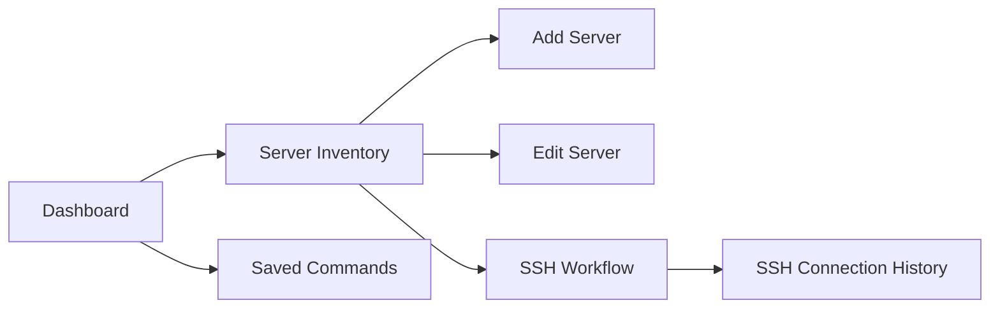
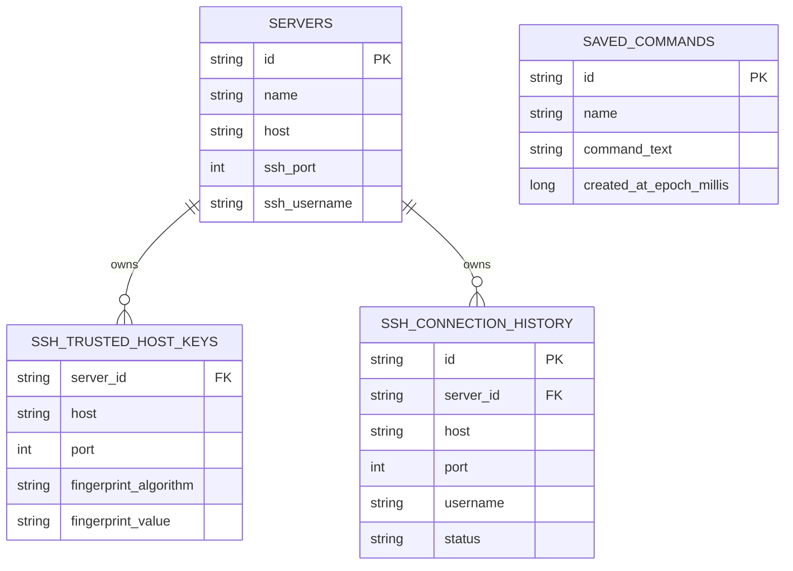
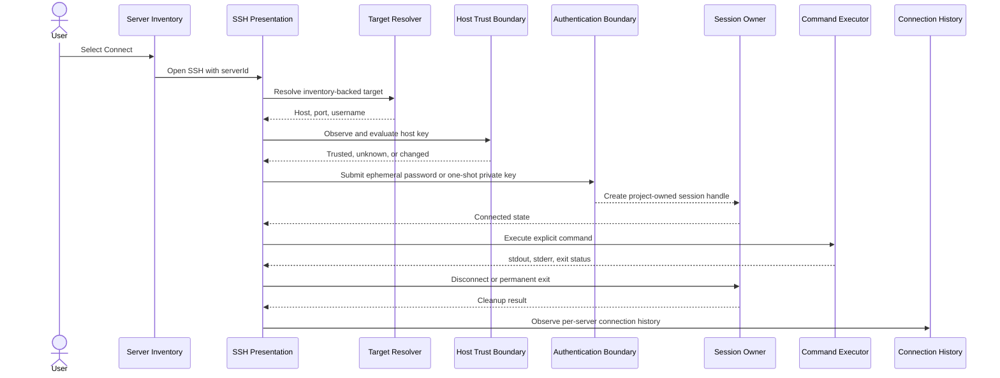
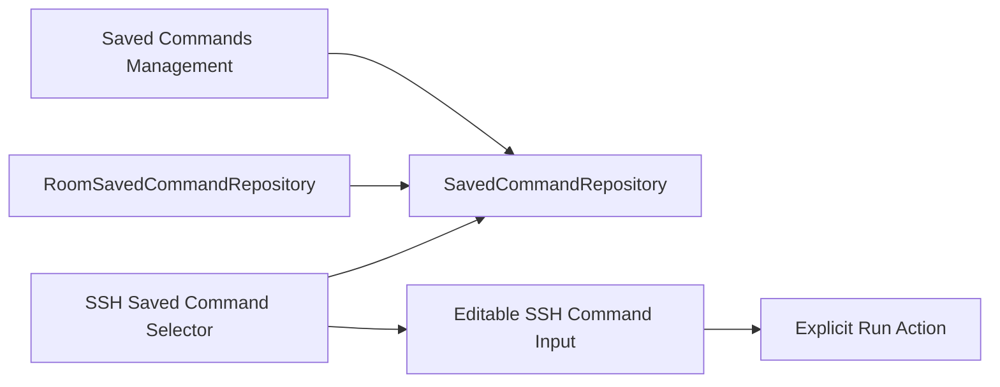
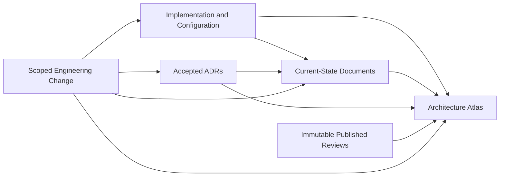

# ServerToolkit Architecture Atlas

> **Atlas version:** `2026.07`
>
> **Status:** Accepted current-state baseline
>
> **Evidence baseline:** `0135faf89b1035fd91c75b37a25ec51bc7c71074`
>
> **Review:** `RA-2026.07-v1`
>
> **Governing Issue:** `#135`
>
> **Repository:** `hamedtanha/ServerToolkit`

## 1. Purpose and Authority

This Atlas is the integrated operational map of the ServerToolkit architecture at the evidence baseline above.

It combines verified repository structure, package ownership, persistence, navigation, SSH lifecycle, Saved Commands integration, build and release workflow, accepted ADRs, and current-state documentation.

It does not replace:

- implementation and repository configuration;
- accepted ADRs;
- `docs/PROJECT_STATE.md`;
- focused documents under `docs/state/`;
- `docs/ARCHITECTURE.md`;
- `PACKAGE_STRUCTURE.md`;
- build, CI, release, or security configuration.

When this Atlas conflicts with executable repository evidence, executable evidence governs and the Atlas must be corrected.

## 2. Evidence Model

| Evidence class | Role | Authority |
|---|---|---|
| Implementation and repository configuration | Executable behavior, dependency, schema, workflow, and lifecycle evidence | Primary |
| Project State and focused state documents | Accepted current implementation summary | Current-state authority |
| Accepted ADRs | Durable decision and rationale | Governing intent |
| Architecture and engineering policies | Accepted implementation and delivery rules | Policy authority |
| Roadmap and changelog | Planned direction and notable history | Supporting authority |
| Published review records | Time-bound findings and recommendations | Historical evidence |

Claims in this Atlas use the following labels:

- **Verified** — directly corroborated by implementation, schema, workflow, build configuration, test evidence, or repository configuration.
- **Documented** — established by an authoritative current-state document but not exhaustively retraced in this Atlas pass.
- **Constrained** — implemented behavior whose validity depends on runtime, platform, environment, release, or local evidence.
- **Target** — accepted future direction that is not implemented.
- **Review Candidate** — a topic selected for assessment but not accepted as architecture or implementation scope.

## 3. Product and Architecture Posture

ServerToolkit is a platform-neutral remote-systems operations application.

The current verified remote-access capability is SSH. SSH is one product capability rather than the complete product identity.

The repository preserves two complementary architecture views.

### 3.1 Android Application Architecture

```text
UI
 ↓
Presentation
 ↓
Domain contracts and models
 ↑
Data implementations
```

### 3.2 Remote Capability Architecture

```text
Presentation / Use Case
        ↓
Core capability contract
        ↓
Capability Gateway
        ↓
Provider / Adapter
        ↓
Transport or external system
```

The remote-capability model is introduced only when a concrete capability requires discovery, translation, routing, normalization, orchestration, policy enforcement, or external integration.

Purely local features do not receive speculative Gateway or Provider abstractions.

## 4. Repository Topology

```text
.
├── .github/
│   └── workflows/
│       └── android-validation.yml
├── app/
│   ├── build.gradle.kts
│   ├── schemas/
│   └── src/
├── config/
│   └── release/
├── docs/
│   ├── adr/
│   ├── engineering/
│   ├── state/
│   ├── ARCHITECTURE.md
│   ├── ARCHITECTURE_ATLAS.md
│   ├── DOCUMENTATION.md
│   ├── ENGINEERING_STRATEGY.md
│   ├── PRODUCT_VISION.md
│   ├── PROJECT_STATE.md
│   ├── RELEASES.md
│   └── ROADMAP.md
├── review/
│   └── architecture/
├── scripts/
│   └── release/
├── PACKAGE_STRUCTURE.md
└── README.md
```

### 4.1 Android Source Topology

```text
de.hamedtanha.servertoolkit
├── MainActivity
├── ServerToolkitApplication
├── core
│   ├── common
│   ├── database
│   └── di
├── feature
│   ├── dashboard
│   ├── serverinventory
│   ├── ssh
│   └── savedcommands
├── navigation
└── ui
    └── theme
```

Packages exist for implemented responsibilities. Empty speculative Gateway, Provider, plugin, platform, or Operations hierarchies are not part of the current production structure.

## 5. Ownership Matrix

| Boundary | Owns | Must not own |
|---|---|---|
| Application shell | Android entry points, application composition, app navigation registration | Feature business logic, Room behavior, SSHJ details |
| `core/database` | Application Room schema aggregation and explicit migrations | Feature business policy |
| `core/di` | Application-wide dependency construction | Feature-owned behavior |
| Dashboard | Product overview and entry actions | Server Inventory, SSH, or Saved Commands persistence |
| Server Inventory | Current `Server` records, inventory workflows, search, filtering, and Room persistence | Active SSH session lifecycle |
| SSH | Target resolution, host trust, ephemeral authentication, session ownership, command input, explicit execution, output, history, disconnect, and cleanup | Saved Commands DAO, entity, concrete repository, screen, or ViewModel |
| Saved Commands | Global reusable command definitions, validation, persistence, observation, management UI, and navigation | SSH transport, session lifecycle, or automatic execution |
| App navigation | Destination registration and cross-feature route composition | Feature data ownership |
| `docs/` | Living accepted current state, policy, and navigation | Immutable time-bound review snapshots |
| `review/` | Evidence-bound assessments, findings, and proposals | Mutable current-state authority or implicit implementation approval |

## 6. Dependency Direction

Allowed dependency direction:

```text
presentation -> domain contracts and models
data -> domain contracts and models
feature DI -> feature contracts and implementations
app navigation -> feature destinations and route entry points
```

Narrow Room aggregation exception:

```text
core/database -> feature-owned Room entities and DAOs
```

The exception exists because Room requires one application database schema. It does not transfer feature business ownership to `core/database`.

Verified cross-feature contract:

```text
SSH presentation -> SavedCommandRepository
```

The SSH feature consumes the project-owned Saved Commands domain contract. It does not consume Saved Commands data or presentation implementations.

Forbidden dependency direction:

```text
domain -> data
domain -> Android framework
presentation -> DAO
presentation -> Room entity
presentation -> concrete external provider
feature A data -> feature B data
feature A presentation -> feature B presentation
```

## 7. Navigation Topology

The application uses one app-level Navigation Compose host.



Navigation ownership:

- Dashboard emits narrow callbacks for Server Inventory and Saved Commands.
- Server Inventory emits Add, Edit, and Connect actions.
- The SSH destination receives a server identifier.
- SSH connection history remains a separate per-server destination.
- Permanent exit from an active SSH workflow is deferred until required session cleanup completes.
- Back closes the Saved Command selector before requesting permanent SSH workflow exit.

## 8. Server Inventory Baseline

### 8.1 Current Domain Model

The current `Server` model contains:

```text
id
name
host
sshPort
sshUsername
environment
category
tags
isFavorite
description
```

Current characteristics:

- one stable application identifier;
- one host value;
- one SSH port;
- one optional SSH username;
- user-managed environment, category, tags, favorite, and description metadata;
- no credential secret fields;
- no platform-discovery result;
- no capability profile;
- no multi-endpoint collection;
- no operational health state.

### 8.2 Current Persistence Model

The `servers` Room table mirrors the current flat domain record through an explicit entity/domain mapper.

Server Inventory owns the record and repository contract. SSH resolves connection targets from the stored inventory record instead of owning a duplicate username or target record.

### 8.3 Scaling Boundary

The current model is an accepted inventory baseline, not a complete long-term server profile.

A multi-level Server Profile is a **Review Candidate**. Identity, endpoints, trust evidence, authentication references, detected platform facts, capability evidence, operational metadata, preferences, and historical evidence require a separate domain review before any entity or migration is accepted.

## 9. Persistence Topology

The current Room database version is:

```text
5
```

Registered entities:

```text
servers
ssh_trusted_host_keys
ssh_connection_history
saved_commands
```

Migration sequence:

```text
1 -> 2  add trusted SSH host keys
2 -> 3  add Server foreign key and cascade delete to trusted host keys
3 -> 4  add SSH connection history
4 -> 5  add Saved Commands
```

Relationship map:



Persistence invariants:

- feature-owned entities and DAOs remain in their owning features;
- repositories expose project-owned domain models;
- Room entities do not leak to presentation;
- schema changes require explicit migrations;
- trusted host keys and SSH connection history are deleted when their owning Server is deleted;
- Saved Commands are global and have no Server foreign key;
- ordinary Room tables do not store passwords, private keys, passphrases, access tokens, or other credential secrets.

## 10. SSH Runtime Architecture

### 10.1 Workflow Map



### 10.2 Trust Boundary

Host trust is explicit and fail-closed:

- observed fingerprints use SHA256 representation;
- unknown host keys require user confirmation;
- changed host keys are blocked;
- trusted keys are persisted per Server, host, and port;
- trust records are deleted when the owning Server is deleted;
- authentication secrets are invalidated when an attempt enters host-key review.

A host-key fingerprint verifies SSH host identity. It is not an operating-system or capability classification mechanism.

### 10.3 Authentication Boundary

Implemented authentication is ephemeral:

- password input remains transient;
- private-key documents are converted into a project-owned one-shot source;
- private-key material is read with bounded size;
- passphrases remain outside observable UI state and saved state;
- no persistent URI permission or key copy is retained;
- no temporary private-key file is created;
- application-owned secret buffers receive best-effort clearing;
- persistent credential storage is not implemented.

### 10.4 Session Ownership and Cleanup

The SSH feature owns active project session handles behind project-owned contracts.

Current invariants:

- command execution and session close are serialized through the session owner boundary;
- workflow exit waits for deterministic cleanup;
- explicit disconnect uses the same cleanup orchestration;
- duplicate close requests are suppressed;
- connection and command execution block conflicting exit operations;
- close failure preserves retry state;
- successful cleanup clears stale command output;
- cancellation is preserved while cleanup remains best-effort and bounded.

### 10.5 Command Execution

Command execution is:

- explicit;
- non-interactive;
- initiated only through the Run action;
- routed through the active project-owned session handle;
- mapped to project-owned result and error models;
- presented as stdout, stderr, and exit status;
- protected from stale result publication after session invalidation;
- cancellation-aware;
- closed through command-channel cleanup.

Interactive terminal behavior and automatic or background execution are not implemented.

## 11. Saved Commands Integration

Saved Commands is a local feature with direct repository ownership.



Boundary rules:

- Saved Commands owns model validation, persistence, observation, creation, deletion, and management UI.
- Commands are global and are not assigned to individual Servers.
- Command text is preserved exactly.
- Persistence does not parse, normalize, interpolate, or execute command text.
- SSH owns mutable command input and execution.
- Selecting a command only replaces the editable input.
- Selection never executes automatically.
- Run remains the sole execution trigger.

## 12. Security and Trust Boundaries

| Concern | Current boundary |
|---|---|
| SSH host identity | Explicit observation, user review, trusted-host persistence, changed-key blocking |
| Passwords | Transient input only |
| Private keys | One-shot document source, bounded in-memory use, no persistent import |
| Passphrases | Transient and outside observable state |
| Room | Non-secret structured configuration, trust evidence, history, and Saved Commands |
| Command execution | Explicit user action only |
| Session lifecycle | Project-owned handle and deterministic cleanup |
| Release signing | Local fail-closed workflow; secrets outside repository |
| User-visible failures | Project-owned normalized results rather than raw SSHJ or platform exceptions |

## 13. Build, CI, and Release Topology

### 13.1 Android Validation

The `Android Validation` workflow runs on pull requests targeting `main`, pushes to `main`, and manual dispatch.

```text
Ubuntu 24.04
Temurin JDK 17
Gradle setup
:app:compileDebugKotlin
:app:compileDebugAndroidTestKotlin
:app:testDebugUnitTest
:app:lintDebug
:app:assembleDebug
:app:assembleDebugAndroidTest
```

Concurrent runs for the same workflow and ref are cancelled.

### 13.2 Build Baseline

The documented current compatibility cluster is:

```text
Gradle 9.5.0
Android Gradle Plugin 9.3.0
Kotlin 2.4.10
KSP 2.3.10
Java source/target and Kotlin toolchain 17
Gradle daemon JVM criteria 21
```

### 13.3 Release Boundary

Android release signing is a local post-build workflow.

```text
assembleRelease
-> zipalign
-> apksigner sign
-> apksigner verify
-> certificate fingerprint verification
-> application metadata verification
-> SHA-256 checksum
-> release evidence
```

Signing secrets and recovery locations remain outside the repository. GitHub Actions does not perform official release signing.

## 14. Documentation and Review Topology



Document roles:

| Location | Role |
|---|---|
| `docs/ARCHITECTURE.md` | Practical authoritative architecture rules |
| `docs/ARCHITECTURE_ATLAS.md` | Integrated current-state map and navigation surface |
| `docs/PROJECT_STATE.md` | Primary current implementation entry point |
| `docs/state/` | Focused current implementation baselines |
| `docs/engineering/` | Engineering policy navigation and focused reusable rules |
| `docs/adr/` | Immutable accepted decisions and rationale |
| `review/` | Time-bound evidence, findings, assessments, and proposals |

Review documents do not authorize implementation. Accepted review recommendations must be translated into ADRs, current-state documentation, roadmap decisions, and focused implementation Issues.

## 15. Current Strengths

- Platform-neutral product direction with evidence-based support language.
- Feature-first ownership with project-owned domain contracts.
- Explicit dependency direction and narrow Room aggregation exception.
- Mature SSH trust, secret-lifetime, session, cancellation, and cleanup boundaries.
- Explicit Run-only command execution.
- Saved Commands integration without cross-feature data or presentation coupling.
- Explicit Room migrations and migration evidence through version `5`.
- Current CI compilation, test, lint, and debug assembly gate.
- Local fail-closed release signing with repository-external secrets.
- ADR-governed architecture and living documentation policy.

## 16. Accepted Trade-offs and Constraints

- App navigation is a central composition boundary and knows all current destinations.
- `core/database` imports feature entities and DAOs for Room schema aggregation.
- The SSH feature owns a broad connected-workflow lifecycle because trust, authentication, session, command execution, output, and cleanup are currently one operational flow.
- The current `Server` record contains one SSH endpoint and flat metadata.
- Saved Commands are global rather than Server-specific.
- The application has no production Capability Gateway or Provider hierarchy yet.
- Verified platform support remains limited to documented SSH-compatible environments.
- Release signing remains a local maintainer-operated process.

## 17. Confirmed Gaps and Review Triggers

### Documentation Consistency

At the evidence baseline, the review found:

- `docs/PROJECT_STATE.md` still described final review and merge of PR `#134` as future work after the PR had merged.
- `docs/state/SSH_STATUS.md` still described official version `0.4.0` release preparation as incomplete.
- `docs/state/SSH_STATUS.md` still listed Saved Commands and Room migration version `5` as unimplemented.
- `docs/RELEASES.md` contained a milestone map that no longer matched `docs/ROADMAP.md`.
- GitHub Issue `#122` remained open after all accepted Saved Command Foundation slices were implemented.

The documentation inconsistencies are corrected or recorded by review `RA-2026.07-v1`. Issue lifecycle cleanup remains a separate GitHub administrative action.

### Architecture Review Triggers

The following are review triggers, not accepted solutions:

- the central `Server` concept needs a scalable multi-level profile assessment;
- identity and endpoint ownership need explicit analysis before multi-endpoint support;
- trust evidence must remain separate from platform and capability classification;
- capability discovery needs consent, freshness, invalidation, parsing, persistence, and support-state design;
- modern SSH workspace and navigation design must preserve one session owner and explicit cleanup;
- no new Gradle module, generic Gateway, Provider registry, or plugin framework is justified without concrete evidence.

## 18. Accepted Evolution Constraints

The repository currently accepts these future-direction constraints:

1. Core meaning remains platform-neutral.
2. Support claims remain architecturally permitted, implemented, or verified.
3. Gateway-backed capabilities use explicit supported, unsupported, unknown, and unavailable states.
4. Unknown or unsupported capabilities do not trigger guessed commands.
5. Providers own platform-specific command construction and parsing.
6. Automatic or background execution requires a separate accepted decision.
7. Significant persistence, security, ownership, or dependency-direction changes require ADR review.
8. Working architecture is evolved incrementally rather than rewritten for aesthetic purity.

No multi-level Server Profile, capability-discovery schema, command catalog, or SSH workspace redesign is accepted by this Atlas.

## 19. Maintenance Contract

This Atlas is versioned by publication date and evidence baseline.

It must be reviewed when a change affects any mapped:

- feature or package ownership;
- dependency direction;
- navigation destination or flow;
- Room entity, relationship, version, or migration;
- trust, authentication, session, command, or cleanup lifecycle;
- cross-feature contract;
- CI or release path;
- support claim;
- architecture invariant;
- documentation authority.

An Atlas update must:

1. identify the new evidence baseline;
2. recheck affected implementation and configuration;
3. update only impacted maps and claims;
4. preserve published review immutability;
5. link governing ADRs;
6. distinguish current state from Target or Review Candidate material;
7. record the update in `docs/CHANGELOG.md`.

## 20. Primary Navigation

Current-state sources:

- [`PROJECT_STATE.md`](PROJECT_STATE.md)
- [`ARCHITECTURE.md`](ARCHITECTURE.md)
- [`engineering/README.md`](engineering/README.md)
- [`state/SERVER_INVENTORY_STATUS.md`](state/SERVER_INVENTORY_STATUS.md)
- [`state/SSH_STATUS.md`](state/SSH_STATUS.md)
- [`state/SAVED_COMMANDS_STATUS.md`](state/SAVED_COMMANDS_STATUS.md)
- [`../PACKAGE_STRUCTURE.md`](../PACKAGE_STRUCTURE.md)

Decision sources:

- [`adr/README.md`](adr/README.md)
- [`adr/ADR-015-platform-neutral-remote-systems-product-direction.md`](adr/ADR-015-platform-neutral-remote-systems-product-direction.md)
- [`adr/ADR-016-three-level-remote-capability-architecture.md`](adr/ADR-016-three-level-remote-capability-architecture.md)

Review evidence:

- [`../review/INDEX.md`](../review/INDEX.md)
- [`../review/architecture/2026/RA-2026.07-v1/`](../review/architecture/2026/RA-2026.07-v1/)
