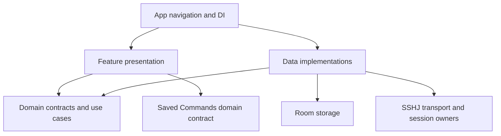

# ServerToolkit architecture review

## 1. Decision and scope

**Keep the existing feature-first architecture. Correct resource ownership and command I/O before expanding remote operations. A wholesale rewrite, immediate multi-module migration, or generic Gateway/plugin framework is not justified.**

The codebase has meaningful domain boundaries, adapter isolation, explicit SSH trust, one-attempt authentication, and useful tests. Its main weakness is the distance between documented lifecycle guarantees and what happens at cancellation, blocking I/O, and terminal Android lifecycle boundaries. Some engineering rules also rely on documentation rather than executable enforcement.

This is an external review artifact, not an accepted ADR, repository-published review, release approval, or implementation instruction. No repository file, branch, commit, Issue, PR, comment, workflow, release, or setting was changed. Findings and proposed tasks require separate maintainer authorization before implementation.

### Exact baseline

- Source: [main at 2800f3a](https://github.com/hamedtanha/ServerToolkit/commit/2800f3a250e9b2733dc040a69a9a1f851538d84e), committed 2026-09-05 09:15:55 UTC.
- Latest change: [PR #163](https://github.com/hamedtanha/ServerToolkit/pull/163), accepting the visual identity baseline and ADR-017. It did not change production SSH behavior.
- Current application version metadata: `0.4.0`. Saved Commands is implemented as part of the subsequent Operations increment; do not infer missing functionality from version metadata.
- Room: schema version 5, explicit migrations 1→2→3→4→5.
- Build declarations: Gradle 9.6.1, AGP 9.4.0, Kotlin 2.4.10, KSP 2.3.10; SSHJ 0.38.0 and declared coroutines 1.9.0. These are declarations, not a newly resolved transitive dependency graph. [E42]
- At inspection: zero open PRs; open Issues #159, #160, #161.
- Earlier destructive Server `REPLACE` behavior was corrected by [PR #144](https://github.com/hamedtanha/ServerToolkit/pull/144). Current DAO uses `@Upsert`; this review does **not** reopen the fixed defect. [E36]

### Method and limitations

The full recursive repository tree was retrieved without truncation. A 314-file text snapshot was retrieved at the exact commit for inspection. All 139 production Kotlin files received a lexical import/dependency scan; selected implementation paths, tests, policies, ADRs, and recent merged PRs received deeper review. The snapshot includes 75 JVM-test Kotlin files and 14 Android-test Kotlin files. Lexical counts find 389 JVM and 78 Android `@Test` annotations; these counts are not test-run results or coverage percentages.

This review did not execute Gradle, Android instrumentation, a live SSH connection, or release signing. It did not audit every test assertion, generated Room implementation, dependency vulnerability, historical commit, binary artifact, or screenshot. Static findings identify concrete code paths but are not claimed as newly reproduced Android failures. A separate local RSA fingerprint-encoding experiment was executed and checked against `ssh-keygen`; details are in F03.

## 2. Architecture actually implemented

| Boundary | Current owner and relationship | Assessment |
|---|---|---|
| Application composition | Single `:app`, Hilt application, Activity, `AppNavHost` | Appropriate at this size; module boundaries are not enforced by the compiler. |
| Server Inventory | Feature-owned Server/repository, Room persistence, forms and filtering | Clear ownership; failure/retry handling trails Saved Commands. |
| Shared target resolution | `core/connection/domain` contract, inventory-owned implementation | Narrow, justified cross-feature boundary; preserves stable inventory identity. |
| SSH orchestration | Domain use cases and project-owned request/result/session types | Good separation; session handoff needs cancellation-safe ownership. |
| SSH transport | SSHJ adapters, client/channel implementations, singleton owner registry | Correct location; output/resource policy is incomplete. |
| Saved Commands | Global command definitions, domain repository/factory, Room, independent management UI | Coherent local feature; does not need a Gateway. |
| SSH command selection | SSH presentation consumes Saved Commands domain contracts | Permitted dependency; exact text replacement does not execute the command. |
| Persistence | Central Room database aggregates feature entities/DAOs | Reasonable composition exception; FK type references need explicit documentation. |
| UI identity | `ui/designsystem/theme` and accepted visual profile | Keep the baseline; address collection layout separately. |
| Future capabilities | ADR-015/016 define direction; no production Gateway/provider framework | Deliberate non-implementation, not a missing architecture layer. |



This graph is a responsibility/dependency view, not a claim of separate Gradle modules. Android route composition and Room foreign-key exceptions are discussed in F07. Sources: [E23] [E24] [E25] [E14].

### Strengths to preserve

1. **SDK-independent domain.** The production import scan found no Domain imports of Android, Compose, Room, SSHJ, concrete data, or presentation types. `javax.inject` and coroutines are present; this is framework-light, not dependency-free Domain.
2. **Trust verification is repeated on the authenticated connection.** The observation-phase permissive verifier is separate from the trusted verifier. Authentication uses the stored endpoint/fingerprint and checks the real key again. Do not replace the observation verifier blindly or describe it as an authenticated trust bypass. [E11] [E04]
3. **Secrets have explicit transient ownership.** Presence-only ViewModel state, redacted credential models, one-shot source claiming, a 256 KiB key-data limit, and bounded OpenSSH KDF metadata checks are meaningful safeguards. They do not promise JVM String zeroization. [E34] [E35]
4. **Persistence semantics are intentional.** Server upsert preserves child evidence; explicit deletion retains cascades; Saved Command update checks one affected row and preserves stable identity. [E36] [E37]
5. **Explicit execution is preserved.** Selection only replaces editable command text; Run is the execution trigger. There is no reason to add automation, terminal semantics, or credentials to Saved Commands. [E43]
6. **Tests and change history have substance.** There are migration tests, DAO/repository tests, adapter tests, cancellation tests, and separately scoped fixes. The shortcomings below concern specific uncovered interleavings and CI enforcement, not an absence of testing. [E22]

## 3. Findings register

Priority meanings: **P1** = high-priority correctness/resource risk to resolve before adding remote execution features; **P2** = concrete defect, assurance gap, or maintainability issue suitable for a focused follow-up. Confidence concerns the evidence, not the frequency of the failure. No P0 emergency or demonstrated authentication bypass was established.

| ID | Priority | Confidence | Finding | Tracking |
|---|---|---|---|---|
| F01 | P1 | High | Connected session can be orphaned at a cancellation handoff | New finding |
| F02 | P1 | High | Command waits for closure before draining bounded transport streams | New finding |
| F03 | P2 | High | Displayed host fingerprint is not the standard OpenSSH fingerprint | New finding; independent encoding check |
| F04 | P2 | Medium | Terminal workflow destruction has no session cleanup fallback | New lifecycle gap; device reproduction required |
| F05 | P2 | High | Inventory failure handling leaks raw errors and lacks explicit observation recovery | New finding |
| F06 | P2 | High | CI does not execute Android/Room tests | Existing workflow gap, not absence of local evidence |
| F07 | P2 | High | Dependency rules are unenforced and omit actual narrow exceptions | Architecture contract gap |
| F08 | P2 | High | `main` has no enforced branch/ruleset protection | Already tracked: #160 |
| F09 | P2 | High | Competing governance and stale bootstrap/package guidance can mislead agents | #159 overlaps; additional examples below |
| F10 | P2 | High | Inventory actions compress primary content under constrained space | Already tracked: #161 / ADR-017 |

### F01 — Cancellation can orphan an authenticated session

**Evidence:** `SshjConnectionService.connect` registers the owner inside `withContext(Dispatchers.IO)`, then returns the handle across a dispatcher boundary. Its cancellation handler only rethrows; its `finally` clears authentication, not the registered session. The outer use case also returns through `withTimeout` without retaining an owner/handle for rollback. The registry is an application singleton. [E01] [E02] [E03] [E04]

**Failure scenario:** Authentication succeeds and registers a live owner. Before the caller receives the `Connected` result, its job is cancelled or the connection deadline expires. Cancellation can discard the result. The ViewModel never records the handle, so normal workflow cleanup cannot identify that connection; the singleton still retains its SSH client.

**Why this is credible:** Kotlin documents cancellable dispatcher return and resource loss at this boundary. The exact app defect is an inference from that documented behavior and the inspected code, not an executed Android reproduction. The outer timeout boundary must be considered even if the inner service is repaired. See [withContext semantics](https://kotlinlang.org/api/kotlinx.coroutines/kotlinx-coroutines-core/kotlinx.coroutines/with-context.html) and [withTimeout resource/cancellation semantics](https://kotlinlang.org/api/kotlinx.coroutines/kotlinx-coroutines-core/kotlinx.coroutines/with-timeout.html).

**Smallest correction direction:** Make session ownership transfer explicit across the complete adapter→use case→caller chain. Until delivery is committed, one scope must retain responsibility for closing/removing an undelivered owner. Use existing lifecycle contracts and bounded cleanup. Merely adding `ensureActive()` before registration is insufficient because cancellation can occur afterward. Do not make the entire connection attempt non-cancellable.

**Acceptance:** Deterministic tests cancel (a) after authenticated-owner creation, (b) after registry insertion but before dispatcher resumption, and (c) before outer timeout delivery. In each undelivered case the owner closes and registry entry disappears; delivered success keeps exactly one usable owner. Verify cleanup-failure behavior and preservation of the primary cancellation/timeout. Existing `SshjConnectionServiceTest` tests executor-thrown cancellation but not this post-registration handoff.

### F02 — Command I/O ordering can produce false timeouts and uncontrolled output retention

**Evidence:** The executor calls `channel.join(timeout)` before reading stdout or stderr, then uses sequential `readBytes()` conversions. Only `join` receives the request deadline; the service merely switches to an I/O dispatcher. [E05] [E06] [E07]

**Failure scenario:** A command writes enough output to exhaust the SSH receive window before it can finish. The application is waiting for channel closure, while the remote command needs the application to drain output before it can finish and close. The command is then reported as timed out. Separately, a channel that exposes exit status before stream EOF can leave the subsequent reads outside the intended operation deadline. No application output-retention cap exists.

**Transport evidence:** In pinned SSHJ 0.38.0, `AbstractChannel` defaults `autoExpand` to false and `join` waits on channel closure; `ChannelInputStream.read` adjusts the window and blocks waiting for bytes/EOF. This supports the backpressure finding. The exact byte threshold was not reproduced on a live server. See [AbstractChannel](https://github.com/hierynomus/sshj/blob/v0.38.0/src/main/java/net/schmizz/sshj/connection/channel/AbstractChannel.java) and [ChannelInputStream](https://github.com/hierynomus/sshj/blob/v0.38.0/src/main/java/net/schmizz/sshj/connection/channel/ChannelInputStream.java).

**Smallest correction direction:** Drain stdout/stderr concurrently while waiting for completion, with explicit bounded retention and one operation deadline. Define truncation or output-limit failure in project-owned results. Ensure cancellation actually releases blocking channel I/O; an I/O dispatcher alone does not make blocking calls cancellable. This can remain buffered non-interactive command execution; it does not require a terminal or streaming UI.

**Acceptance:** Test stdout-heavy, stderr-heavy, mixed output beyond receive-window capacity, output-limit handling, missing/late EOF, timeout during draining, and cancellation during an actual blocking read. Assert channel cleanup and bounded retained bytes. Do not claim that closing a local SSH channel guarantees termination of every remote process. Current tests use small in-memory streams and exception injection; those tests cannot reveal transport backpressure.

### F03 — Host fingerprint uses Java encoding rather than SSH wire encoding

**Evidence:** `toSshjHostKeyFingerprint()` hashes `PublicKey.encoded` and labels the digest `SHA256`; the UI displays `SHA256:<value>`. Its test computes its expectation using the same encoding, so it verifies implementation consistency rather than OpenSSH interoperability. The trusted verifier uses the same mapper, so app-internal matching can still work. [E08] [E09] [E10] [E11]

**User impact:** A user comparing the displayed RSA host fingerprint with `ssh-keygen -lf ... -E sha256` sees different values for the same key. This undermines the explicit out-of-band trust review. It is not evidence of a cryptographic collision or a demonstrated authentication bypass.

**Independent check executed:** A transient RSA-2048 public key was serialized both as X.509 SubjectPublicKeyInfo DER and as an SSH public-key blob. No private-key file was written. The two SHA-256 digests differed; `ssh-keygen` matched the SSH-blob digest:

```text
Java X.509/SPKI digest: SHA256:Dn4A+TAegYR5rs6ea0o7MApBzfm3AzPRzAOtwQ2ZQ8o
SSH public-key digest: SHA256:q5so0Q/NJ0+kKoZym4ICRYlZXtIhk7eS7bDcdi3D30E
ssh-keygen result:     SHA256:q5so0Q/NJ0+kKoZym4ICRYlZXtIhk7eS7bDcdi3D30E
```

This verifies the encoding difference independently; it is not an execution of the Android mapper. SSHJ's RSA decoder constructs a JCA RSA public key, and OpenSSH fingerprints serialized SSH key blobs: [SSHJ KeyType](https://github.com/hierynomus/sshj/blob/v0.38.0/src/main/java/net/schmizz/sshj/common/KeyType.java), [OpenSSH fingerprint implementation](https://github.com/openssh/openssh-portable/blob/master/sshkey.c).

**Smallest correction direction:** Use canonical SSH public-key serialization within the data adapter. Add independent known-answer fixtures for RSA and Ed25519 rather than deriving expected values with the production algorithm.

**Compatibility gate:** Existing trusted rows contain the legacy digest without an encoding discriminator. Do not silently relabel, reinterpret, or overwrite them. Decide an explicit legacy-verification/reconfirmation policy and whether encoding/version metadata requires a migration. Never auto-trust a newly observed key merely to complete migration. A change to persisted trust semantics needs the existing ADR admission review.

**Acceptance:** Display matches independently generated `ssh-keygen` fingerprints for supported host key types; unchanged keys remain verifiable through the accepted transition policy; changed keys stay blocked; old records cannot authorize an unrelated new key.

### F04 — Terminal Android destruction lacks a session cleanup fallback

**Evidence:** `SshRoute` gates normal back/history navigation through `onWorkflowExit`. Its disposal callback clears authentication input. `SshViewModel.onCleared()` cancels selector observation and clears credentials but does not close `activeSessionHandle`. `MainActivity` has no other terminal-session cleanup hook. The owner registry is singleton-scoped. [E14] [E12] [E13] [E15] [E03]

**Risk scenario:** The Activity/back-stack owner is permanently destroyed while the process remains alive and without the route's explicit exit callback, for example terminal Activity finishing or task removal. A live owner may outlive its only workflow handle. Process death itself releases OS resources and is not the claimed leak. Configuration change is also distinct and should preserve the intended ViewModel/session behavior.

**Smallest correction direction:** Define a terminal workflow owner that can schedule cleanup beyond a cancelled ViewModel scope, using project-owned lifecycle contracts. Retain awaited cleanup for normal navigation. Do not close sessions on every composition disposal or rotation, and do not introduce background session continuity without a separate decision.

**Acceptance:** With a controlled registry owner, verify normal Back, history navigation, configuration change, Activity finish without process death, and workflow-owner clearing during connect/command execution. Assert exact cleanup ownership and no dangling owner. Resolve F01 handoff behavior first or in a coordinated bounded slice. Device-level reproduction is required before treating all Android exit paths as demonstrated failures.

### F05 — Repository failure handling is inconsistent across features

**Evidence:** Inventory observation catches errors after `combine`, publishes `throwable.message`, and completes without explicit retry. A continuously subscribed failed observation has no in-place restart path. Add/Edit forms also publish raw exception messages; their `runCatching` blocks consume cancellation as ordinary failure. History observation has a similar retry gap but uses a stable message. Saved Commands already provides an explicit observation restart pattern. [E16] [E17] [E18] [E20] [E19]

**Impact:** A transient storage failure can strand an open screen and reset visible list/filter state. Raw SQLite/provider details become UI copy. Cancellation may be misreported as save/delete failure. This is a boundary-contract problem, not merely wording.

**Smallest correction direction:** Adopt explicit feature-owned failure and retry semantics, preserve last useful state where appropriate, and rethrow `CancellationException` before mapping genuine failures. Reuse the behavioral approach from Saved Commands, not a generic base ViewModel. Keep errors free of secrets and infrastructure internals.

**Acceptance:** Emit data then fail observation; verify preserved data/filter and a user retry that restarts observation once. Fail initial load, save, update, and delete with internal exception text; assert stable UI messages. Cancel a suspended mutation and assert cancellation is not converted into a user-facing repository failure. Add focused tests for Add/Edit/Inventory ViewModels, which currently lack dedicated test files in the retrieved tree.

### F06 — Android/Room regressions are not automatically executed in CI

**Evidence:** The only GitHub workflow compiles Android tests and assembles their APK, but has no connected/managed-device instrumentation execution. Migration, DAO, repository, picker, and Compose tests reside in `androidTest`. [E21] [E22]

**Important qualification:** [Android Validation run #119](https://github.com/hamedtanha/ServerToolkit/actions/runs/33957510965) succeeded at the reviewed commit. [PR #163](https://github.com/hamedtanha/ServerToolkit/pull/163) separately records a local API-36 instrumentation pass of **78 tests**. [PR #153](https://github.com/hamedtanha/ServerToolkit/pull/153) recorded 64 tests at its earlier baseline, and [PR #144](https://github.com/hamedtanha/ServerToolkit/pull/144) recorded focused Room regression evidence. This finding does not erase that evidence. The gap is repeatable remote enforcement on subsequent changes.

**Smallest correction direction:** Propose a focused emulator/managed-device job for critical Room migrations/repositories and relevant Android lifecycle/UI boundaries, with unambiguous required-check policy for persistence/security changes. Keep ordinary compilation/unit/lint gates. No toolchain upgrade is implied.

**Acceptance:** A PR run executes actual instrumentation tests and exposes reports tied to its SHA; a deliberately failing representative migration/repository test prevents the relevant gate from passing. Keep runtime/resource cost explicit and record rollback of CI configuration. Local evidence remains separately identified.

### F07 — Documented layer rules are not executable, and exceptions are underspecified

**Evidence:** Only `:app` exists. There is no architecture-specific import/dependency check in the retrieved workflow/configuration. A full production Kotlin import scan found:

- No Domain→Android/Room/SSHJ/data/presentation imports.
- Three intended SSH presentation→Saved Commands Domain imports.
- One SSH Route→concrete Android private-key factory import. [E14]
- Two SSH Room-entity→Server Inventory Room-entity imports for foreign keys. [E26] [E27]

The architecture forbids cross-feature data imports while describing only a narrow central Room aggregation exception. That wording does not explicitly account for the two FK annotation references. [E23] [E24] [E25]

**Impact:** Future agents can violate ownership while still compiling, or incorrectly remove valid foreign keys/Android wiring to satisfy an overly broad rule. Kotlin `internal` is module-wide, not feature-private, in this topology.

**Smallest correction direction:** Specify a small dependency matrix and enforce it with a focused static check. Explicitly adjudicate the Android Route composition adapter and Room FK metadata references as named exceptions, or move only the concrete composition responsibility if that is the accepted decision. Preserve relational integrity. Do not introduce a broad allowlist or split modules solely to improve a diagram.

**Acceptance:** A deliberate forbidden Domain→data and feature-presentation→foreign-presentation import fails validation; the actual narrow composition/FK exceptions pass; the documentation matches the checked matrix. An immediate Gradle multi-module migration is not required.

### F08 — `main` governance is not enforced

**Evidence:** Read-only GitHub inspection returned `protected: false` for `main` and `[]` for repository rulesets. No direct-push, force-push, deletion, or required-check rule was established by those responses.

**Tracking:** Reuse [Issue #160](https://github.com/hamedtanha/ServerToolkit/issues/160); do not create a duplicate. Sources: [branch metadata](https://api.github.com/repos/hamedtanha/ServerToolkit/branches/main), [rulesets](https://api.github.com/repos/hamedtanha/ServerToolkit/rulesets). These settings are time-sensitive and must be re-read before action.

**Smallest correction direction:** Require PR-based changes and the existing validation check; prevent routine force-push/deletion; explicitly document a sole-maintainer recovery path. Do not add artificial reviewer-count requirements. Adding protection is a repository-settings action and was not performed in this review.

**Acceptance:** A focused PR demonstrates the intended required checks; a normal direct push is rejected; bypass/recovery behavior is explicit. F06 can subsequently add a correctly named instrumentation gate without pretending it already exists.

### F09 — Documentation can direct agents toward obsolete architecture

**Evidence:** Root `DOCUMENTATION_GOVERNANCE.md` remains active and competes with `docs/DOCUMENTATION.md`. `docs/ai/INTRO.md` describes a Linux administration application while current Project State defines platform-neutral direction. `PACKAGE_STRUCTURE.md` presents `ui/theme`, omits implemented `core/connection`, and lists several navigation/presentation packages absent from the current source tree. Current theme ownership is `ui/designsystem/theme`. [E28] [E29] [E30] [E31] [E25]

`docs/ARCHITECTURE.md` has an accepted-ADR table ending at ADR-016, although ADR-017 is now accepted. The Atlas identifies an older explicit evidence baseline; agents must respect that date rather than treat it as a fresh audit. Its role as a living map needs consistent maintenance under current governance. [E24] [E32] [E44]

**Tracking:** [Issue #159](https://github.com/hamedtanha/ServerToolkit/issues/159) already covers root governance consolidation. Bootstrap/package/ADR-index examples here are additional scope to triage, not permission to silently expand that Issue.

**Smallest correction direction:** Establish one authority route; turn legacy convenience files into clear pointers only after preserving their surviving rules; synchronize current bootstrap/package facts. Keep historical published reviews and accepted ADR text immutable. Do not infer new product scope from outdated bootstrap prose.

**Acceptance:** No competing active governance source; canonical links resolve; source-package map reflects implemented ownership; new-agent entry guidance matches platform-neutral scope; accepted ADR indexing includes ADR-017. Preserve the distinct public root security policy and package authority unless an explicit ownership decision changes them.

### F10 — Collection layout violates the accepted growth contract

**Evidence:** `ServerInventoryListItem` places weighted primary content beside three inline text actions in one row. The child action region can consume the width needed by the information column. The implementation does use lazy rendering and stable server IDs; those are strengths, not missing fixes. [E33] [E32]

**Tracking:** [Issue #161](https://github.com/hamedtanha/ServerToolkit/issues/161) records the observed failure at 200% font scale. This is independently recorded repository evidence plus static layout inspection; no new screenshot validation was performed here.

**Smallest correction direction:** Implement a constrained-width layout that reflows/separates actions while preserving primary operational text. Keep the accepted visual tokens. Do not reduce fonts to hide the defect, add speculative pagination, or redesign the Server model.

**Acceptance:** Long server names/hosts, narrow width, and 200% font scale retain readable primary content and reachable Connect/Edit/Delete actions. Add representative stress fixtures; apply the accepted collection contract to future Saved Commands growth without assuming it already fails identically.

## 4. Additional bounded observations

These are not extra P1 findings and should not inflate the immediate remediation batch.

- **History write can extend connection completion.** `recordConnectionHistoryEntry` uses `NonCancellable` outside the connection timeout with no separate persistence deadline. A stalled history repository can delay completion despite the comment that history must not replace the primary outcome. Define bounded best-effort persistence before treating the 10-second timeout as end-to-end. No actual Room stall was reproduced. [E39]
- **Observation errors lose useful meaning.** Host-key observation maps exceptions to `Unavailable`, then the use case maps that to `UnsupportedConfiguration`. A DNS/connect failure in the first handshake never reaches the later executor's more specific UnknownHost mapping. Revisit only with a focused outcome-contract test; the 2026-07 runtime review evaluated a narrower path. [E38] [E02]
- **Presentation complexity is concentrated.** `SshViewModel` is 834 lines with multiple operation flags and handles; Saved Commands ViewModel is 510 lines. Size alone is not a defect. During F01/F04, consider one explicit connection/session transition model if it removes duplicated invariants. Do not add generic coordinators, state machines, or base ViewModels without a concrete reduction in responsibility.
- **Security assurance remains bounded.** Backup/device transfer exclusions are present. This review did not establish cryptographic-provider CVE status, release binary provenance, or every hostile document/provider behavior. Do not interpret a clean layer scan as a security certification. [E40] [E41]

## 5. Proposed sequence for later authorized work

| Slice | Findings | Concrete result | Dependency / restraint |
|---|---|---|---|
| A | F01 | Cancellation-safe connected-session ownership and deterministic race tests | First runtime correction; no feature expansion. |
| B | F02 | Concurrent bounded command drain and operation-deadline tests | Keep explicit Run and non-interactive scope. |
| C | F03 | Canonical fingerprint plus reviewed legacy trust transition | Decide persistence/security compatibility before modifying stored-trust behavior. |
| D | F04 | Tested terminal workflow cleanup policy | Coordinate with A; preserve rotation semantics. |
| E | F06, F08 | Repeatable critical Android tests and enforceable merge gates | Reuse #160; settings and CI changes remain separately reviewable. |
| F | F05 | Stable repository errors and explicit observation recovery | No generic base framework. |
| G | F07, F09 | Checked dependency contract and coherent agent entry documents | Reuse #159 where its existing scope applies; preserve immutable history. |
| H | F10 | Adaptive inventory collection item | Reuse #161 and ADR-017; no token redesign. |

A–D address SSH correctness and lifecycle assurance. E is small engineering leverage and can be planned independently; this is not an instruction to spawn agents or execute changes in parallel. H remains valuable accessibility work, but should not be used as a substitute for resolving remote-execution risks.

### Change-impact map for an implementation agent

All entries below describe **future proposed changes**, not modifications performed by this review.

| Proposed area | Source/test responsibility | Living documents to reassess/update after implementation | Documents/artifacts to preserve |
|---|---|---|---|
| F01/F02/F04 | SSH use cases, adapters, lifecycle service/registry, ViewModel/Route as needed; focused JVM and lifecycle/integration tests | `docs/state/SSH_STATUS.md`, `docs/PROJECT_STATE.md`, `docs/CHANGELOG.md`; `docs/ARCHITECTURE.md` and Atlas if ownership/lifecycle statements change | Existing releases, roadmap scope, Room schemas if unaffected, published reviews; accepted ADR text |
| F03 | Fingerprint adapter/verifier and fixtures; trust repository/schema only if accepted transition requires it | SSH status, security guidance, Project State, changelog; architecture and ADR index if a new durable trust decision is required | No silent rewrite of stored trust or historical release evidence; no assumed schema bump |
| F05 | Inventory/history observation and mutation handling; ViewModel tests | Relevant feature status, Project State, changelog | Room schema, remote trust semantics, product roadmap |
| F06/F08 | CI workflow and settings; real PR validation evidence | Development/CI status, relevant governance, changelog; build-toolchain status only for actual configuration changes | Existing version pins and release-signing identity unless separately justified |
| F07/F09 | Small import rule check and canonical documentation/pointers | Package Structure, architecture, documentation/engineering indexes, bootstrap, Atlas as applicable | Public root SECURITY responsibility, accepted ADRs, immutable `review/` publications |
| F10 | Inventory item layout and stress fixtures | Server Inventory status, relevant visual/collection evidence, Project State/changelog as required | Global typography/color baseline, schema, Server identity, historical calibration evidence |

Before implementation, an agent must explicitly mark each affected document “change” or “unchanged” with a reason, following `docs/ai/AI_RULES.md`. Ordinary implementation corrections default to no new ADR; only unresolved durable ownership/security/persistence/lifecycle decisions pass the ADR admission gate.

## 6. Copyable agent handoff

```text
TASK: Triage STK-ARCH-2026-09-05 against current ServerToolkit.
REPOSITORY: hamedtanha/ServerToolkit
REVIEW BASELINE: 2800f3a250e9b2733dc040a69a9a1f851538d84e
MODE: READ ONLY until the maintainer authorizes one concrete implementation slice.

1. Read docs/PROJECT_STATE.md, relevant docs/state documents,
   docs/DOCUMENTATION.md, docs/ai/AI_RULES.md, docs/ai/AI_MEMORY.md,
   applicable ADRs, current source/tests, and recent relevant merged PRs.
2. Compare current HEAD with the review baseline. Revalidate every chosen
   finding against current code; do not copy stale line numbers as evidence.
3. Use stable IDs F01-F10. For each chosen finding report CONFIRMED,
   ALREADY_FIXED, NEEDS_RUNTIME_REPRODUCTION, or NOT_APPLICABLE, with evidence.
4. Reuse Issue #159 for its governance scope, #160 for main protection,
   and #161 for constrained collection layout. Do not create duplicate issues.
5. Preserve feature-first ownership, SDK isolation, stable Server identity,
   explicit host trust, one-attempt credentials, exact Saved Command text,
   explicit Run, and project-owned SSH resource contracts.
6. No generic Gateway/plugin framework, premature module split, terminal,
   background execution, credential persistence, schema redesign, or bulk
   dependency upgrades as incidental review cleanup.
7. Before a correction: identify exact files/tests/docs, compatibility and
   lifecycle implications, the relevant regression test, and ADR need.
8. F01 requires real cancellation timing tests, not just an executor that
   throws CancellationException. F02 requires stream/backpressure tests.
   F03 requires independent ssh-keygen fixtures and a legacy-trust policy.
9. Distinguish test source, reported local evidence, observed CI results,
   newly executed tests, and static inference. Never report unrun tests PASS.
10. Do not modify or publish repository files, settings, issues, comments,
    branches, PRs, releases, or accepted historical records without the
    maintainer's subsequent task authorization.

EXPECTED RESPONSE:
- Current HEAD and baseline drift.
- Revalidated finding IDs with source evidence.
- Smallest proposed slice and exact acceptance criteria.
- Source/test/document impact and explicit exclusions.
- No implementation unless separately authorized.
```

## 7. Validation evidence and audit trail

| Evidence | Result | Meaning |
|---|---|---|
| Repository tree | Complete recursive response, `truncated=false` | File inventory was not inferred from search snippets. |
| Pinned text retrieval | 314 files retrieved | Reviewable source snapshot; not every file received line-by-line semantic review. |
| Production import scan | 139 Kotlin files scanned | No forbidden Domain imports found by the lexical rules; narrow exceptions recorded in F07. |
| Existing CI at reviewed SHA | Android Validation #119, success | Compile, unit tests, lint, debug APK/test APK tasks; instrumentation not run by workflow. |
| Existing local Android evidence | PR #163 reports API 36, `OK (78 tests)` | Repository-reported evidence, not rerun by this reviewer. |
| Fingerprint experiment | DER and SSH-blob digests differ; `ssh-keygen` matches SSH blob | Independent verification of F03 encoding issue for RSA. |
| New Android/Gradle/live SSH execution | Not performed | F01/F02/F04 require focused runtime/regression validation before a fix is accepted. |
| Repository mutations | None | No write-capable GitHub action used. |

Recent context inspected includes PRs #163 (visual acceptance), #162 (build cluster), #153 (Saved Command editing), #144 (non-destructive Server save), #143 (ADR governance), and #139/#142 (previous review acceptance/publication). Prior accepted reviews are historical evidence; this report does not replace or amend them.

## 8. Commit-pinned source references

Every E-reference below resolves to the reviewed commit. GitHub API settings, CI status, Issue state, and external dependency documentation are separate time-sensitive evidence linked in the relevant findings.

[E01]: https://github.com/hamedtanha/ServerToolkit/blob/2800f3a250e9b2733dc040a69a9a1f851538d84e/app/src/main/java/de/hamedtanha/servertoolkit/feature/ssh/data/service/SshjConnectionService.kt#L52-L98 "app/src/main/java/de/hamedtanha/servertoolkit/feature/ssh/data/service/SshjConnectionService.kt:52–98"
[E02]: https://github.com/hamedtanha/ServerToolkit/blob/2800f3a250e9b2733dc040a69a9a1f851538d84e/app/src/main/java/de/hamedtanha/servertoolkit/feature/ssh/domain/usecase/SshConnectionAttemptUseCase.kt#L62-L114 "app/src/main/java/de/hamedtanha/servertoolkit/feature/ssh/domain/usecase/SshConnectionAttemptUseCase.kt:62–114"
[E03]: https://github.com/hamedtanha/ServerToolkit/blob/2800f3a250e9b2733dc040a69a9a1f851538d84e/app/src/main/java/de/hamedtanha/servertoolkit/feature/ssh/data/service/SshjSessionOwnerRegistry.kt#L20-L98 "app/src/main/java/de/hamedtanha/servertoolkit/feature/ssh/data/service/SshjSessionOwnerRegistry.kt:20–98"
[E04]: https://github.com/hamedtanha/ServerToolkit/blob/2800f3a250e9b2733dc040a69a9a1f851538d84e/app/src/main/java/de/hamedtanha/servertoolkit/feature/ssh/data/service/SshjTrustedConnectionExecutor.kt#L53-L115 "app/src/main/java/de/hamedtanha/servertoolkit/feature/ssh/data/service/SshjTrustedConnectionExecutor.kt:53–115"
[E05]: https://github.com/hamedtanha/ServerToolkit/blob/2800f3a250e9b2733dc040a69a9a1f851538d84e/app/src/main/java/de/hamedtanha/servertoolkit/feature/ssh/data/service/SshjCommandChannelExecutor.kt#L55-L92 "app/src/main/java/de/hamedtanha/servertoolkit/feature/ssh/data/service/SshjCommandChannelExecutor.kt:55–92"
[E06]: https://github.com/hamedtanha/ServerToolkit/blob/2800f3a250e9b2733dc040a69a9a1f851538d84e/app/src/main/java/de/hamedtanha/servertoolkit/feature/ssh/data/service/SshjCommandChannelExecutor.kt#L117-L145 "app/src/main/java/de/hamedtanha/servertoolkit/feature/ssh/data/service/SshjCommandChannelExecutor.kt:117–145"
[E07]: https://github.com/hamedtanha/ServerToolkit/blob/2800f3a250e9b2733dc040a69a9a1f851538d84e/app/src/main/java/de/hamedtanha/servertoolkit/feature/ssh/data/service/SshjCommandExecutionService.kt#L23-L33 "app/src/main/java/de/hamedtanha/servertoolkit/feature/ssh/data/service/SshjCommandExecutionService.kt:23–33"
[E08]: https://github.com/hamedtanha/ServerToolkit/blob/2800f3a250e9b2733dc040a69a9a1f851538d84e/app/src/main/java/de/hamedtanha/servertoolkit/feature/ssh/data/service/SshjHostKeyFingerprintMapper.kt#L14-L29 "app/src/main/java/de/hamedtanha/servertoolkit/feature/ssh/data/service/SshjHostKeyFingerprintMapper.kt:14–29"
[E09]: https://github.com/hamedtanha/ServerToolkit/blob/2800f3a250e9b2733dc040a69a9a1f851538d84e/app/src/test/java/de/hamedtanha/servertoolkit/feature/ssh/data/service/SshjHostKeyFingerprintMapperTest.kt#L11-L29 "app/src/test/java/de/hamedtanha/servertoolkit/feature/ssh/data/service/SshjHostKeyFingerprintMapperTest.kt:11–29"
[E10]: https://github.com/hamedtanha/ServerToolkit/blob/2800f3a250e9b2733dc040a69a9a1f851538d84e/app/src/main/java/de/hamedtanha/servertoolkit/feature/ssh/presentation/state/SshHostKeyReviewUiState.kt#L5-L25 "app/src/main/java/de/hamedtanha/servertoolkit/feature/ssh/presentation/state/SshHostKeyReviewUiState.kt:5–25"
[E11]: https://github.com/hamedtanha/ServerToolkit/blob/2800f3a250e9b2733dc040a69a9a1f851538d84e/app/src/main/java/de/hamedtanha/servertoolkit/feature/ssh/data/service/SshjTrustedHostKeyVerifierFactory.kt#L25-L41 "app/src/main/java/de/hamedtanha/servertoolkit/feature/ssh/data/service/SshjTrustedHostKeyVerifierFactory.kt:25–41"
[E12]: https://github.com/hamedtanha/ServerToolkit/blob/2800f3a250e9b2733dc040a69a9a1f851538d84e/app/src/main/java/de/hamedtanha/servertoolkit/feature/ssh/presentation/viewmodel/SshViewModel.kt#L191-L243 "app/src/main/java/de/hamedtanha/servertoolkit/feature/ssh/presentation/viewmodel/SshViewModel.kt:191–243"
[E13]: https://github.com/hamedtanha/ServerToolkit/blob/2800f3a250e9b2733dc040a69a9a1f851538d84e/app/src/main/java/de/hamedtanha/servertoolkit/feature/ssh/presentation/viewmodel/SshViewModel.kt#L648-L653 "app/src/main/java/de/hamedtanha/servertoolkit/feature/ssh/presentation/viewmodel/SshViewModel.kt:648–653"
[E14]: https://github.com/hamedtanha/ServerToolkit/blob/2800f3a250e9b2733dc040a69a9a1f851538d84e/app/src/main/java/de/hamedtanha/servertoolkit/feature/ssh/presentation/screen/SshScreen.kt#L42-L105 "app/src/main/java/de/hamedtanha/servertoolkit/feature/ssh/presentation/screen/SshScreen.kt:42–105"
[E15]: https://github.com/hamedtanha/ServerToolkit/blob/2800f3a250e9b2733dc040a69a9a1f851538d84e/app/src/main/java/de/hamedtanha/servertoolkit/MainActivity.kt "app/src/main/java/de/hamedtanha/servertoolkit/MainActivity.kt"
[E16]: https://github.com/hamedtanha/ServerToolkit/blob/2800f3a250e9b2733dc040a69a9a1f851538d84e/app/src/main/java/de/hamedtanha/servertoolkit/feature/serverinventory/presentation/viewmodel/ServerInventoryViewModel.kt#L28-L49 "app/src/main/java/de/hamedtanha/servertoolkit/feature/serverinventory/presentation/viewmodel/ServerInventoryViewModel.kt:28–49"
[E17]: https://github.com/hamedtanha/ServerToolkit/blob/2800f3a250e9b2733dc040a69a9a1f851538d84e/app/src/main/java/de/hamedtanha/servertoolkit/feature/serverinventory/presentation/viewmodel/AddServerViewModel.kt#L97-L142 "app/src/main/java/de/hamedtanha/servertoolkit/feature/serverinventory/presentation/viewmodel/AddServerViewModel.kt:97–142"
[E18]: https://github.com/hamedtanha/ServerToolkit/blob/2800f3a250e9b2733dc040a69a9a1f851538d84e/app/src/main/java/de/hamedtanha/servertoolkit/feature/serverinventory/presentation/viewmodel/EditServerViewModel.kt#L99-L176 "app/src/main/java/de/hamedtanha/servertoolkit/feature/serverinventory/presentation/viewmodel/EditServerViewModel.kt:99–176"
[E19]: https://github.com/hamedtanha/ServerToolkit/blob/2800f3a250e9b2733dc040a69a9a1f851538d84e/app/src/main/java/de/hamedtanha/servertoolkit/feature/savedcommands/presentation/viewmodel/SavedCommandsViewModel.kt#L37-L46 "app/src/main/java/de/hamedtanha/servertoolkit/feature/savedcommands/presentation/viewmodel/SavedCommandsViewModel.kt:37–46"
[E20]: https://github.com/hamedtanha/ServerToolkit/blob/2800f3a250e9b2733dc040a69a9a1f851538d84e/app/src/main/java/de/hamedtanha/servertoolkit/feature/ssh/presentation/viewmodel/SshConnectionHistoryViewModel.kt#L28-L52 "app/src/main/java/de/hamedtanha/servertoolkit/feature/ssh/presentation/viewmodel/SshConnectionHistoryViewModel.kt:28–52"
[E21]: https://github.com/hamedtanha/ServerToolkit/blob/2800f3a250e9b2733dc040a69a9a1f851538d84e/.github/workflows/android-validation.yml ".github/workflows/android-validation.yml"
[E22]: https://github.com/hamedtanha/ServerToolkit/blob/2800f3a250e9b2733dc040a69a9a1f851538d84e/app/src/androidTest/java/de/hamedtanha/servertoolkit/core/database/ServerToolkitDatabaseMigrationTest.kt "app/src/androidTest/java/de/hamedtanha/servertoolkit/core/database/ServerToolkitDatabaseMigrationTest.kt"
[E23]: https://github.com/hamedtanha/ServerToolkit/blob/2800f3a250e9b2733dc040a69a9a1f851538d84e/settings.gradle.kts "settings.gradle.kts"
[E24]: https://github.com/hamedtanha/ServerToolkit/blob/2800f3a250e9b2733dc040a69a9a1f851538d84e/docs/ARCHITECTURE.md "docs/ARCHITECTURE.md"
[E25]: https://github.com/hamedtanha/ServerToolkit/blob/2800f3a250e9b2733dc040a69a9a1f851538d84e/PACKAGE_STRUCTURE.md "PACKAGE_STRUCTURE.md"
[E26]: https://github.com/hamedtanha/ServerToolkit/blob/2800f3a250e9b2733dc040a69a9a1f851538d84e/app/src/main/java/de/hamedtanha/servertoolkit/feature/ssh/data/local/entity/SshTrustedHostKeyEntity.kt#L3-L24 "app/src/main/java/de/hamedtanha/servertoolkit/feature/ssh/data/local/entity/SshTrustedHostKeyEntity.kt:3–24"
[E27]: https://github.com/hamedtanha/ServerToolkit/blob/2800f3a250e9b2733dc040a69a9a1f851538d84e/app/src/main/java/de/hamedtanha/servertoolkit/feature/ssh/data/local/entity/SshConnectionHistoryEntity.kt#L3-L26 "app/src/main/java/de/hamedtanha/servertoolkit/feature/ssh/data/local/entity/SshConnectionHistoryEntity.kt:3–26"
[E28]: https://github.com/hamedtanha/ServerToolkit/blob/2800f3a250e9b2733dc040a69a9a1f851538d84e/DOCUMENTATION_GOVERNANCE.md "DOCUMENTATION_GOVERNANCE.md"
[E29]: https://github.com/hamedtanha/ServerToolkit/blob/2800f3a250e9b2733dc040a69a9a1f851538d84e/docs/DOCUMENTATION.md "docs/DOCUMENTATION.md"
[E30]: https://github.com/hamedtanha/ServerToolkit/blob/2800f3a250e9b2733dc040a69a9a1f851538d84e/docs/ai/INTRO.md "docs/ai/INTRO.md"
[E31]: https://github.com/hamedtanha/ServerToolkit/blob/2800f3a250e9b2733dc040a69a9a1f851538d84e/docs/PROJECT_STATE.md "docs/PROJECT_STATE.md"
[E32]: https://github.com/hamedtanha/ServerToolkit/blob/2800f3a250e9b2733dc040a69a9a1f851538d84e/docs/adr/ADR-017-scalable-collection-ux-contract.md "docs/adr/ADR-017-scalable-collection-ux-contract.md"
[E33]: https://github.com/hamedtanha/ServerToolkit/blob/2800f3a250e9b2733dc040a69a9a1f851538d84e/app/src/main/java/de/hamedtanha/servertoolkit/feature/serverinventory/presentation/screen/ServerInventoryScreen.kt#L372-L451 "app/src/main/java/de/hamedtanha/servertoolkit/feature/serverinventory/presentation/screen/ServerInventoryScreen.kt:372–451"
[E34]: https://github.com/hamedtanha/ServerToolkit/blob/2800f3a250e9b2733dc040a69a9a1f851538d84e/app/src/main/java/de/hamedtanha/servertoolkit/feature/ssh/data/source/OneShotSshPrivateKeySource.kt "app/src/main/java/de/hamedtanha/servertoolkit/feature/ssh/data/source/OneShotSshPrivateKeySource.kt"
[E35]: https://github.com/hamedtanha/ServerToolkit/blob/2800f3a250e9b2733dc040a69a9a1f851538d84e/app/src/main/java/de/hamedtanha/servertoolkit/feature/ssh/data/service/OpenSshPrivateKeyMetadataValidator.kt "app/src/main/java/de/hamedtanha/servertoolkit/feature/ssh/data/service/OpenSshPrivateKeyMetadataValidator.kt"
[E36]: https://github.com/hamedtanha/ServerToolkit/blob/2800f3a250e9b2733dc040a69a9a1f851538d84e/app/src/main/java/de/hamedtanha/servertoolkit/feature/serverinventory/data/local/dao/ServerDao.kt#L18-L23 "app/src/main/java/de/hamedtanha/servertoolkit/feature/serverinventory/data/local/dao/ServerDao.kt:18–23"
[E37]: https://github.com/hamedtanha/ServerToolkit/blob/2800f3a250e9b2733dc040a69a9a1f851538d84e/app/src/main/java/de/hamedtanha/servertoolkit/feature/savedcommands/data/repository/RoomSavedCommandRepository.kt "app/src/main/java/de/hamedtanha/servertoolkit/feature/savedcommands/data/repository/RoomSavedCommandRepository.kt"
[E38]: https://github.com/hamedtanha/ServerToolkit/blob/2800f3a250e9b2733dc040a69a9a1f851538d84e/app/src/main/java/de/hamedtanha/servertoolkit/feature/ssh/data/service/SshjHostKeyObservationService.kt#L38-L55 "app/src/main/java/de/hamedtanha/servertoolkit/feature/ssh/data/service/SshjHostKeyObservationService.kt:38–55"
[E39]: https://github.com/hamedtanha/ServerToolkit/blob/2800f3a250e9b2733dc040a69a9a1f851538d84e/app/src/main/java/de/hamedtanha/servertoolkit/feature/ssh/domain/usecase/SshConnectionAttemptUseCase.kt#L217-L247 "app/src/main/java/de/hamedtanha/servertoolkit/feature/ssh/domain/usecase/SshConnectionAttemptUseCase.kt:217–247"
[E40]: https://github.com/hamedtanha/ServerToolkit/blob/2800f3a250e9b2733dc040a69a9a1f851538d84e/app/src/main/AndroidManifest.xml "app/src/main/AndroidManifest.xml"
[E41]: https://github.com/hamedtanha/ServerToolkit/blob/2800f3a250e9b2733dc040a69a9a1f851538d84e/app/src/main/res/xml/data_extraction_rules.xml "app/src/main/res/xml/data_extraction_rules.xml"
[E42]: https://github.com/hamedtanha/ServerToolkit/blob/2800f3a250e9b2733dc040a69a9a1f851538d84e/gradle/libs.versions.toml "gradle/libs.versions.toml"
[E43]: https://github.com/hamedtanha/ServerToolkit/blob/2800f3a250e9b2733dc040a69a9a1f851538d84e/app/src/main/java/de/hamedtanha/servertoolkit/feature/ssh/presentation/viewmodel/SshViewModel.kt "app/src/main/java/de/hamedtanha/servertoolkit/feature/ssh/presentation/viewmodel/SshViewModel.kt"
[E44]: https://github.com/hamedtanha/ServerToolkit/blob/2800f3a250e9b2733dc040a69a9a1f851538d84e/docs/ARCHITECTURE_ATLAS.md "docs/ARCHITECTURE_ATLAS.md"

- **E01** — `app/src/main/java/de/hamedtanha/servertoolkit/feature/ssh/data/service/SshjConnectionService.kt`, lines 52–98. [E01]
- **E02** — `app/src/main/java/de/hamedtanha/servertoolkit/feature/ssh/domain/usecase/SshConnectionAttemptUseCase.kt`, lines 62–114. [E02]
- **E03** — `app/src/main/java/de/hamedtanha/servertoolkit/feature/ssh/data/service/SshjSessionOwnerRegistry.kt`, lines 20–98. [E03]
- **E04** — `app/src/main/java/de/hamedtanha/servertoolkit/feature/ssh/data/service/SshjTrustedConnectionExecutor.kt`, lines 53–115. [E04]
- **E05** — `app/src/main/java/de/hamedtanha/servertoolkit/feature/ssh/data/service/SshjCommandChannelExecutor.kt`, lines 55–92. [E05]
- **E06** — `app/src/main/java/de/hamedtanha/servertoolkit/feature/ssh/data/service/SshjCommandChannelExecutor.kt`, lines 117–145. [E06]
- **E07** — `app/src/main/java/de/hamedtanha/servertoolkit/feature/ssh/data/service/SshjCommandExecutionService.kt`, lines 23–33. [E07]
- **E08** — `app/src/main/java/de/hamedtanha/servertoolkit/feature/ssh/data/service/SshjHostKeyFingerprintMapper.kt`, lines 14–29. [E08]
- **E09** — `app/src/test/java/de/hamedtanha/servertoolkit/feature/ssh/data/service/SshjHostKeyFingerprintMapperTest.kt`, lines 11–29. [E09]
- **E10** — `app/src/main/java/de/hamedtanha/servertoolkit/feature/ssh/presentation/state/SshHostKeyReviewUiState.kt`, lines 5–25. [E10]
- **E11** — `app/src/main/java/de/hamedtanha/servertoolkit/feature/ssh/data/service/SshjTrustedHostKeyVerifierFactory.kt`, lines 25–41. [E11]
- **E12** — `app/src/main/java/de/hamedtanha/servertoolkit/feature/ssh/presentation/viewmodel/SshViewModel.kt`, lines 191–243. [E12]
- **E13** — `app/src/main/java/de/hamedtanha/servertoolkit/feature/ssh/presentation/viewmodel/SshViewModel.kt`, lines 648–653. [E13]
- **E14** — `app/src/main/java/de/hamedtanha/servertoolkit/feature/ssh/presentation/screen/SshScreen.kt`, lines 42–105. [E14]
- **E15** — `app/src/main/java/de/hamedtanha/servertoolkit/MainActivity.kt`. [E15]
- **E16** — `app/src/main/java/de/hamedtanha/servertoolkit/feature/serverinventory/presentation/viewmodel/ServerInventoryViewModel.kt`, lines 28–49. [E16]
- **E17** — `app/src/main/java/de/hamedtanha/servertoolkit/feature/serverinventory/presentation/viewmodel/AddServerViewModel.kt`, lines 97–142. [E17]
- **E18** — `app/src/main/java/de/hamedtanha/servertoolkit/feature/serverinventory/presentation/viewmodel/EditServerViewModel.kt`, lines 99–176. [E18]
- **E19** — `app/src/main/java/de/hamedtanha/servertoolkit/feature/savedcommands/presentation/viewmodel/SavedCommandsViewModel.kt`, lines 37–46. [E19]
- **E20** — `app/src/main/java/de/hamedtanha/servertoolkit/feature/ssh/presentation/viewmodel/SshConnectionHistoryViewModel.kt`, lines 28–52. [E20]
- **E21** — `.github/workflows/android-validation.yml`. [E21]
- **E22** — `app/src/androidTest/java/de/hamedtanha/servertoolkit/core/database/ServerToolkitDatabaseMigrationTest.kt`. [E22]
- **E23** — `settings.gradle.kts`. [E23]
- **E24** — `docs/ARCHITECTURE.md`. [E24]
- **E25** — `PACKAGE_STRUCTURE.md`. [E25]
- **E26** — `app/src/main/java/de/hamedtanha/servertoolkit/feature/ssh/data/local/entity/SshTrustedHostKeyEntity.kt`, lines 3–24. [E26]
- **E27** — `app/src/main/java/de/hamedtanha/servertoolkit/feature/ssh/data/local/entity/SshConnectionHistoryEntity.kt`, lines 3–26. [E27]
- **E28** — `DOCUMENTATION_GOVERNANCE.md`. [E28]
- **E29** — `docs/DOCUMENTATION.md`. [E29]
- **E30** — `docs/ai/INTRO.md`. [E30]
- **E31** — `docs/PROJECT_STATE.md`. [E31]
- **E32** — `docs/adr/ADR-017-scalable-collection-ux-contract.md`. [E32]
- **E33** — `app/src/main/java/de/hamedtanha/servertoolkit/feature/serverinventory/presentation/screen/ServerInventoryScreen.kt`, lines 372–451. [E33]
- **E34** — `app/src/main/java/de/hamedtanha/servertoolkit/feature/ssh/data/source/OneShotSshPrivateKeySource.kt`. [E34]
- **E35** — `app/src/main/java/de/hamedtanha/servertoolkit/feature/ssh/data/service/OpenSshPrivateKeyMetadataValidator.kt`. [E35]
- **E36** — `app/src/main/java/de/hamedtanha/servertoolkit/feature/serverinventory/data/local/dao/ServerDao.kt`, lines 18–23. [E36]
- **E37** — `app/src/main/java/de/hamedtanha/servertoolkit/feature/savedcommands/data/repository/RoomSavedCommandRepository.kt`. [E37]
- **E38** — `app/src/main/java/de/hamedtanha/servertoolkit/feature/ssh/data/service/SshjHostKeyObservationService.kt`, lines 38–55. [E38]
- **E39** — `app/src/main/java/de/hamedtanha/servertoolkit/feature/ssh/domain/usecase/SshConnectionAttemptUseCase.kt`, lines 217–247. [E39]
- **E40** — `app/src/main/AndroidManifest.xml`. [E40]
- **E41** — `app/src/main/res/xml/data_extraction_rules.xml`. [E41]
- **E42** — `gradle/libs.versions.toml`. [E42]
- **E43** — `app/src/main/java/de/hamedtanha/servertoolkit/feature/ssh/presentation/viewmodel/SshViewModel.kt`. [E43]
- **E44** — `docs/ARCHITECTURE_ATLAS.md`. [E44]
